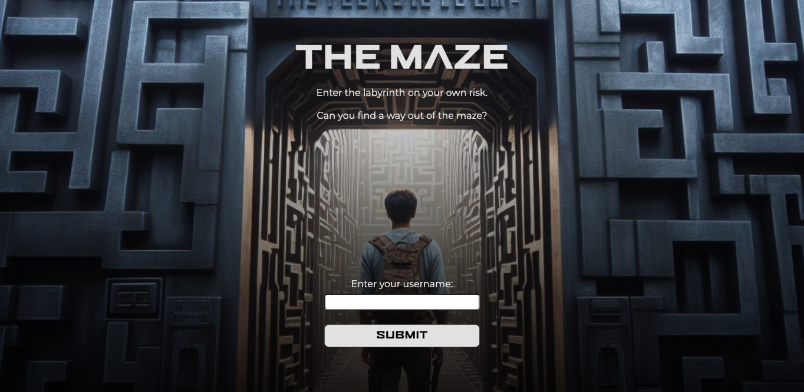

<h1 align="center">
  
</h1>

# Labyrinth - Zustand Project

This project is a labyrinth game app and is using the zustand library. Fetching from an API to show players where they can navigate.

### The Problem

First we tried to layout what we needed and what we wanted to achieve. Next step was to take a look at the API results in Postman. We struggle to fetch 'POST' from two different URLs and connecting them.
Thanks to help from a fellow bootcamp student, the game finally worked. It took longer than we expected and wanted to.

### View it live

Here our maze game.

## Instructions

<a href="https://fun-maze.netlify.app/">
   Labyrinth Maze
  </a>
